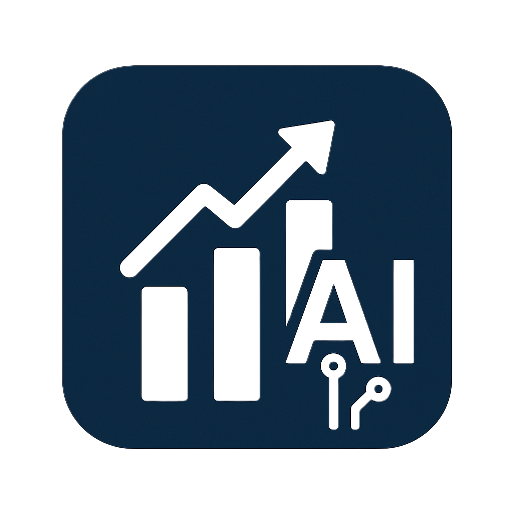

<h1 style="font-size: 3em; font-weight: bold; color: #2c3e50; margin-top: 20px; text-shadow: 2px 2px 4px rgba(0,0,0,0.1);">Tales Job</h1>

Medikal ve Kimyasal Tedarikçiler için Gelişmiş Ürün Arama Motoru

<!-- Teknolojilere ait rozetler -->

<!-- Proje Hakkında Bölümü -->

<h2 style="color: #2c3e50; border-bottom: 2px solid #3498db; padding-bottom: 10px;">🚀 Proje Hakkında</h2>

<b>Tales Job</b>, kimya ve medikal sektöründe faaliyet gösteren profesyonellerin, birden fazla tedarikçi sitesindeki ürünleri tek bir platform üzerinden hızlıca aratmasını sağlayan bir masaüstü uygulamasıdır. Python tabanlı güçlü web scraping yetenekleri ile Electron.js'in cross-platform gücünü birleştirerek, kullanıcılara zaman kazandıran modern ve etkili bir çözüm sunar.

<!-- Özellikler Bölümü -->

<h2 style="color: #2c3e50; border-bottom: 2px solid #2ecc71; padding-bottom: 10px;">✨ Temel Özellikler</h2>
<ul style="list-style-type: none; padding: 0; color: #34495e;">
<li style="margin-bottom: 10px; font-size: 1.1em;">🌐 <b>Çoklu Tedarikçi Desteği:</b> Sigma, TCI, Netflex gibi birden fazla tedarikçi sitesinde aynı anda arama yapabilme.</li>
<li style="margin-bottom: 10px; font-size: 1.1em;">💻 <b>Platform Bağımsız:</b> Electron.js sayesinde Windows, macOS ve Linux işletim sistemlerinde sorunsuz çalışır.</li>
<li style="margin-bottom: 10px; font-size: 1.1em;">🎨 <b>Modern Arayüz:</b> Next.js, TypeScript ve Tailwind CSS ile geliştirilmiş, kullanıcı dostu ve şık bir arayüz.</li>
<li style="margin-bottom: 10px; font-size: 1.1em;">💾 <b>Sonuçları Kaydetme:</b> Arama sonuçlarını JSON formatında yerel olarak saklayarak daha sonra inceleme imkanı.</li>
<li style="margin-bottom: 10px; font-size: 1.1em;">⚙️ <b>Esnek Altyapı:</b> Yeni tedarikçilerin (scraper'ların) sisteme kolayca entegre edilebileceği modüler Python altyapısı.</li>
</ul>

<!-- Teknolojiler Bölümü -->

<h2 style="color: #2c3e50; border-bottom: 2px solid #e74c3c; padding-bottom: 10px;">🛠️ Kullanılan Teknolojiler</h2>

<h4 style="color: #34495e;">Backend (Veri Çekme)</h4>
<ul style="list-style: none; padding: 0;">
<li>Python</li>
<li>BeautifulSoup4</li>
<li>Requests</li>
<li>Selenium</li>
</ul>

<h4 style="color: #34495e;">Masaüstü Uygulama</h4>
<ul style="list-style: none; padding: 0;">
<li>Electron.js</li>
<li>Node.js</li>
</ul>

<h4 style="color: #34495e;">Frontend (Arayüz)</h4>
<ul style="list-style: none; padding: 0;">
<li>Next.js</li>
<li>React</li>
<li>TypeScript</li>
<li>Tailwind CSS</li>
<li>Shadcn/ui</li>
</ul>

<!-- Kurulum ve Başlatma Bölümü -->

<h2 style="color: #2c3e50; border-bottom: 2px solid #f39c12; padding-bottom: 10px;">🚀 Kurulum ve Başlatma</h2>

Projeyi yerel makinenizde çalıştırmak için aşağıdaki adımları izleyin:

<h4 style="color: #34495e;">1. Depoyu Klonlayın</h4>
<pre style="background: #2d2d2d; color: #f1f1f1; padding: 15px; border-radius: 5px;"><code>git clone https://www.google.com/search?q=https://github.com/Nurullah649/Tales_Job.git
cd Tales_Job</code></pre>

<h4 style="color: #34495e;">2. Python Bağımlılıklarını Yükleyin</h4>

(Proje ana dizininde bulunan <code>requirements.txt</code> dosyasını kullanarak bağımlılıkları yükleyin.)

<pre style="background: #2d2d2d; color: #f1f1f1; padding: 15px; border-radius: 5px;"><code>pip install -r requirements.txt</code></pre>

<h4 style="color: #34495e;">3. Node.js Bağımlılıklarını Yükleyin</h4>
<pre style="background: #2d2d2d; color: #f1f1f1; padding: 15px; border-radius: 5px;"><code>npm install</code></pre>

<h4 style="color: #34495e;">4. Uygulamayı Başlatın</h4>
<pre style="background: #2d2d2d; color: #f1f1f1; padding: 15px; border-radius: 5px;"><code>npm start</code></pre>

<!-- Katkıda Bulunma Bölümü -->

<h2 style="color: #2c3e50; border-bottom: 2px solid #9b59b6; padding-bottom: 10px;">🤝 Katkıda Bulunma</h2>

Katkılarınız projeyi daha iyi bir hale getirecektir. Bir katkıda bulunmak isterseniz, lütfen depoyu 'fork'layın ve bir 'pull request' oluşturun. Hata bildirimleri ve özellik önerileri için 'Issues' bölümünü kullanabilirsiniz.

<ol style="color: #34495e;">
<li>Projeyi Fork'layın.</li>
<li>Yeni bir özellik dalı oluşturun (<code>git checkout -b feature/YeniOzellik</code>).</li>
<li>Değişikliklerinizi Commit'leyin (<code>git commit -m 'Yeni bir özellik eklendi'</code>).</li>
<li>Dalınızı Push'layın (<code>git push origin feature/YeniOzellik</code>).</li>
<li>Bir Pull Request açın.</li>
</ol>

<!-- Lisans Bölümü -->

Bu proje MIT Lisansı altında lisanslanmıştır. Daha fazla bilgi için <code>LICENSE</code> dosyasına bakın.

Geliştirici: <b>Nurullah</b>

