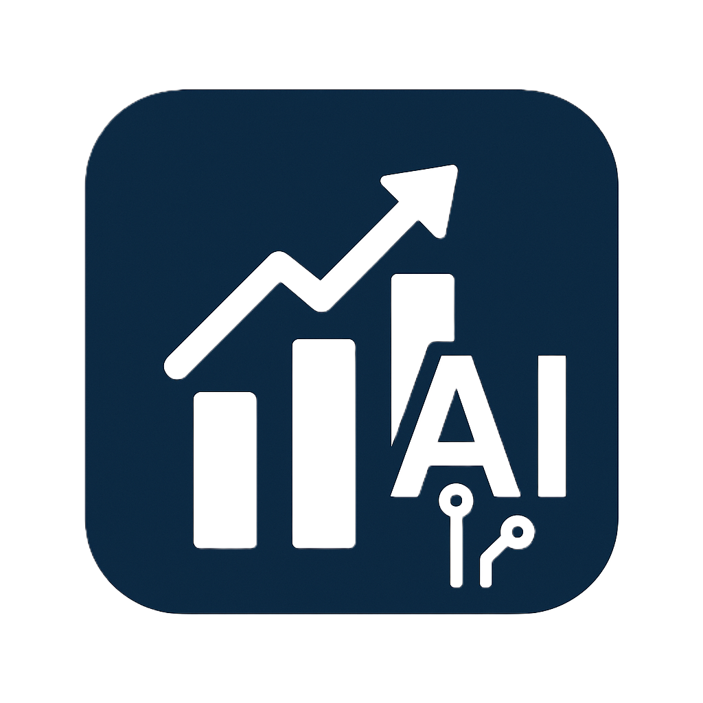

<div align="center">
  

  <h1>NPC-AI ERP</h1>

  <h3>
    Yeni Nesil Akıllı Kurumsal Kaynak Planlama ve<br/>
    Tedarik Zinciri Yönetim Sistemi
  </h3>

  <p>
    <b>Sigma, TCI, Netflex</b> entegrasyonları ile güçlendirilmiş, AI tabanlı satın alma ve stok yönetim çözümü.
  </p>

  <p>
    
    
    
    
    
  </p>
</div>

<br />

## 🚀 Proje Hakkında

**NPC-AI ERP**, özellikle medikal, kimya ve laboratuvar sektörleri için tasarlanmış, yapay zeka destekli bir masaüstü ERP (Enterprise Resource Planning) yazılımıdır.

Geleneksel ERP sistemlerinin hantallığını ortadan kaldırarak; **ürün arama, stok takibi, teklif oluşturma ve faturalandırma** süreçlerini tek bir modern arayüzde birleştirir. Python tabanlı akıllı veri motoru sayesinde, global tedarikçi veritabanlarında (Sigma Aldrich, TCI vb.) saniyeler içinde arama yapar ve en uygun fiyat/stok bilgisini kullanıcının önüne getirir.

---

## ✨ Neden NPC-AI ERP?

| Özellik | Açıklama |
| :--- | :--- |
| **🔍 Akıllı Tedarik** | Manuel ürün aramaya son. Tek tıkla 5+ global tedarikçiyi tarayın. |
| **🔗 Tam Entegrasyon** | Arama sonuçlarını doğrudan stok kartına veya teklife dönüştürün. |
| **☁️ Çevrimdışı Mod** | SQLite altyapısı ile internet kesintilerinde bile verilere erişim sağlayın. |

## ⚙️ Temel Özellikler

### 🔍 AI Destekli Ürün Arama Motoru
* **Global Tarama:** Sigma Aldrich, TCI Chemicals, Netflex ve yerel tedarikçilerde eş zamanlı *CAS No* / *Ürün Adı* araması.
* **Otomatik Veri Çekme:** Ürün görselleri, teknik spekler ve fiyat bilgilerini otomatik olarak sisteme kaydeder.

### 💼 Finans ve Müşteri Yönetimi
* **Teklif & Fatura:** Sürükle-bırak yöntemiyle profesyonel PDF teklifler ve faturalar oluşturun.
* **CRM Modülü:** Müşteri cari hesapları, geçmiş siparişler ve iletişim bilgileri yönetimi.

### 💻 Modern Masaüstü Deneyimi
* **Cross-Platform:** Electron.js sayesinde Windows, macOS ve Linux üzerinde sorunsuz çalışır.
* **Otomatik Güncelleme:** Yazılım, yeni özellikler geldiğinde kendini otomatik olarak günceller.
* **Güvenli Lisanslama:** Sunucu tabanlı lisans doğrulama sistemi ile yazılım güvenliği.

---

## 🛠️ Teknik Mimari

Proje, performans, güvenlik ve geliştirme hızı için **Hybrid** bir mimari kullanır:

| Katman | Teknoloji | Görevi |
| :--- | :--- | :--- |
| **Core (Backend)** | Python / Node.js | Veri kazıma (Scraping), İş mantığı ve API yönetimi. |
| **Application** | Electron.js | Masaüstü pencere yönetimi ve OS entegrasyonu. |
| **Interface (UI)** | React | Hızlı, reaktif ve modern kullanıcı arayüzü. |
| **Database** | SQLite | Yerel, hızlı ve güvenilir veri depolama. |
| **Security** | License Key | Uzaktan sunucu doğrulamalı lisans ve aktivasyon sistemi. |

---

## 🚀 Kurulum ve Geliştirme

Projeyi yerel ortamınızda geliştirmek veya kaynak koddan derlemek için aşağıdaki adımları izleyin:

### Ön Gereksinimler
* Node.js (v16+)
* Python (v3.8+)
* Git

### 1. Depoyu Klonlayın
```bash
git clone [https://github.com/Nurullah649/NPC-AI-ERP.git](https://github.com/Nurullah649/NPC-AI-ERP.git)
cd NPC-AI-ERP

```

### 2. Bağımlılıkları Yükleyin

```bash
# Node.js paketleri (Electron ve React için)
npm install

# Python bağımlılıkları (Veri motoru için)
pip install -r requirements.txt

```

### 3. Geliştirme Modunda Başlatın

```bash
# Hem React sunucusunu hem de Electron penceresini başlatır
npm run dev

```

### 4. Uygulamayı Derleyin (Build)

```bash
# İşletim sisteminize uygun dağıtılabilir dosya (.exe, .dmg, .AppImage) oluşturur
npm run build

```

---

## 🛣️ Yol Haritası (Roadmap)

* [x] Temel ERP Modülleri (Stok, Cari, Fatura)
* [x] Python tabanlı Tedarikçi Scraper Motoru
* [x] Electron ve React Entegrasyonu
* [ ] **v1.5:** AI destekli fiyat tahminleme modülü
* [ ] **v2.0:** Bulut (Cloud) senkronizasyonu ve Mobil Uygulama
* [ ] **v2.1:** E-Fatura entegrasyonu

---

## 🤝 Katkıda Bulunma

Açık kaynak topluluğunun gücüne inanıyoruz! NPC-AI ERP'ye katkıda bulunmak isterseniz:

1. Bu depoyu **Fork**'layın.
2. Yeni bir özellik dalı (branch) oluşturun (`git checkout -b feature/HarikaOzellik`).
3. Değişikliklerinizi commit'leyin (`git commit -m 'HarikaOzellik eklendi'`).
4. Dalınızı push'layın (`git push origin feature/HarikaOzellik`).
5. Bir **Pull Request** oluşturun.

*Lütfen büyük değişiklikler yapmadan önce tartışmak için bir "Issue" açınız.*

---

